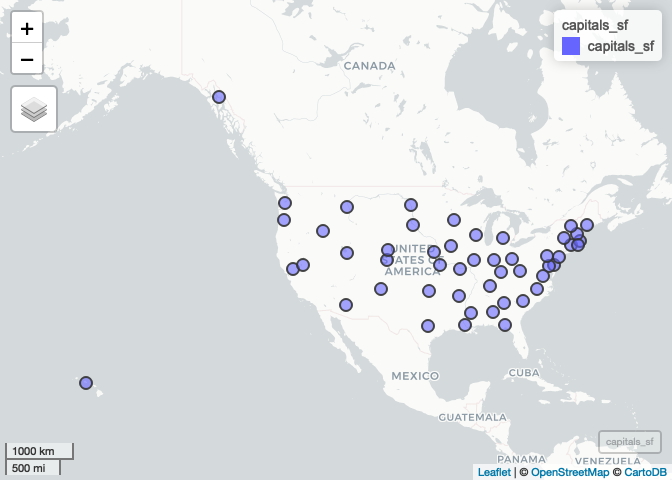

Lab 09 Replication
================
Branson Fox
(March 23, 2019)

Introduction
------------

This notebook replicates the results of lab 09.

Dependencies
------------

This notebook requires the following packages to load and manipulate our data.

``` r
# tidyverse packages
library(readr) # import tabular data
library(dplyr) # data manipulation
```

    ## 
    ## Attaching package: 'dplyr'

    ## The following objects are masked from 'package:stats':
    ## 
    ##     filter, lag

    ## The following objects are masked from 'package:base':
    ## 
    ##     intersect, setdiff, setequal, union

``` r
# other packages
library(here)  # file path management
```

    ## here() starts at /Users/lawrence/Desktop/Lab-09-Replication

``` r
library(sf)    # methods for spatial data
```

    ## Linking to GEOS 3.6.1, GDAL 2.1.3, PROJ 4.9.3

``` r
library(mapview) # interactive map preview
```

Load Data
---------

These are the data we need to complete this lab.

``` r
# spatial 
county_bnd <-st_read(here("data","US_BOUNDARY_Counties","US_BOUNDARY_Counties.shp"), stringsAsFactors = FALSE)
```

    ## Reading layer `US_BOUNDARY_Counties' from data source `/Users/lawrence/Desktop/Lab-09-Replication/data/US_BOUNDARY_Counties/US_BOUNDARY_Counties.shp' using driver `ESRI Shapefile'
    ## Simple feature collection with 3220 features and 5 fields
    ## geometry type:  MULTIPOLYGON
    ## dimension:      XY
    ## bbox:           xmin: -179.1743 ymin: 17.91377 xmax: 179.7739 ymax: 71.35256
    ## epsg (SRID):    NA
    ## proj4string:    +proj=longlat +ellps=GRS80 +no_defs

``` r
# tabular
capitals <- read_csv(here("data","stateCapitals.csv"))
```

    ## Parsed with column specification:
    ## cols(
    ##   name = col_character(),
    ##   description = col_character(),
    ##   latitude = col_double(),
    ##   longitude = col_double()
    ## )

``` r
health_ins <- read_csv(here("data","USHealth","US_HEALTH_noIns.csv"))
```

    ## Parsed with column specification:
    ## cols(
    ##   GEOID = col_character(),
    ##   state = col_character(),
    ##   county = col_character(),
    ##   noIns = col_double()
    ## )

Part 1
------

### Question 1

We'll start by projecting the capitals data we loaded earlier.

``` r
capitals_sf <- st_as_sf(capitals, coords = c(x = "longitude", y = "latitude"), crs = 4269)
```

Then, we'll check that we projected properly using `mpaview`

``` r
mapview(capitals_sf)
```



Next, we'll save the data as a shapefile using the `st_write()` function.

``` r
st_write(capitals_sf, dsn = here("data", "cleanData", "stateCapitals.shp"), delete_dsn = TRUE)
```

    ## Warning in abbreviate_shapefile_names(obj): Field names abbreviated for
    ## ESRI Shapefile driver

    ## Deleting source `/Users/lawrence/Desktop/Lab-09-Replication/data/cleanData/stateCapitals.shp' using driver `ESRI Shapefile'
    ## Writing layer `stateCapitals' to data source `/Users/lawrence/Desktop/Lab-09-Replication/data/cleanData/stateCapitals.shp' using driver `ESRI Shapefile'
    ## features:       50
    ## fields:         2
    ## geometry type:  Point

### Part B

Next we'll work with the county boundary and health insurance data. First, we want to join these data. `GEOID` appears to be a common variable among them, but it is character in one data.frame and numeric in the other. To fix this, we can `mutate` one class to match the other.

``` r
health_ins <- mutate(health_ins, GEOID = as.numeric(GEOID))
```

Now we can table join as usual.

``` r
cnty_health <- left_join(county_bnd, health_ins, by = "GEOID")
```

### Part C

We want to subset our data to remove the observations with missing data. Since we know that −1 denotes missing data, we'll `filter` for observations where `noIns` is &gt; = 0

``` r
cnty_health <- filter(cnty_health, noIns >= 0)
```

### Part D

We're almost ready to export the data, but first we need to check the projection. We can do this with `st_crs()`

``` r
st_crs(cnty_health)
```

    ## Coordinate Reference System:
    ##   No EPSG code
    ##   proj4string: "+proj=longlat +ellps=GRS80 +no_defs"

And we find that there is no coordinate reference system. We can use the same `st_crs()` function to set the coordinate reference system. Note that this is different from `st_transform()` that changes data from one projection to another. Instead, we are setting the coordinate reference system to NAD 1983 (or epsg code 4269) because that is the original projection of our data.

``` r
st_crs(cnty_health) <- 4269
```

Finally, we are ready to export:

``` r
st_write(cnty_health, dsn = here("data", "cleanData", "countyHealth.shp"), delete_dsn = TRUE)
```

    ## Deleting source `/Users/lawrence/Desktop/Lab-09-Replication/data/cleanData/countyHealth.shp' using driver `ESRI Shapefile'
    ## Writing layer `countyHealth' to data source `/Users/lawrence/Desktop/Lab-09-Replication/data/cleanData/countyHealth.shp' using driver `ESRI Shapefile'
    ## features:       3135
    ## fields:         8
    ## geometry type:  Multi Polygon

Part 2 - Part 4
---------------

These parts should be completed in ArcGIS Pro. See the additional replication materials.
