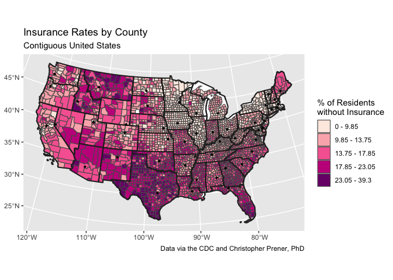
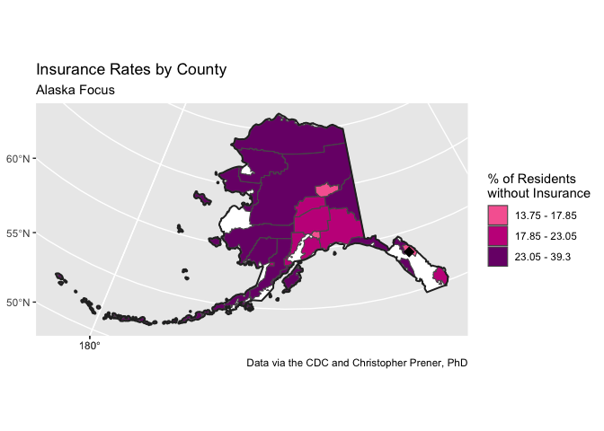
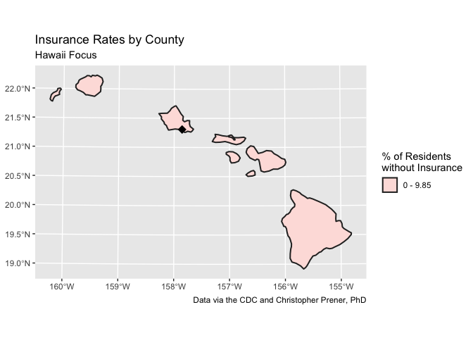

Lab 3-1 Replication
================
Branson Fox, BA and Christopher Prener, PhD
(February 28, 2022)

## Introduction

This notebook replicates the results of lab 06

## Dependencies

This notebook requires the following packages to load and manipulate our
data.

``` r
# tidyverse packages
library(dplyr)          # data manipulation
```

    ## 
    ## Attaching package: 'dplyr'

    ## The following objects are masked from 'package:stats':
    ## 
    ##     filter, lag

    ## The following objects are masked from 'package:base':
    ## 
    ##     intersect, setdiff, setequal, union

``` r
library(ggplot2)        # static mapping
library(readr)          # import tabular data

# spatial packages
library(sf)             # methods for spatial data
```

    ## Linking to GEOS 3.8.1, GDAL 3.2.1, PROJ 7.2.1

``` r
library(mapview)        # interactive map preview
library(tigris)         # TIGER/Line Data
```

    ## To enable 
    ## caching of data, set `options(tigris_use_cache = TRUE)` in your R script or .Rprofile.

``` r
# other packages
library(here)           # file path management
```

    ## here() starts at /Users/prenercg/GitHub/slu-soc5650/module-3-projections/assignments/lab-3-1-replication

``` r
library(RColorBrewer)   # color palettes

# functions
source(here("source", "map_breaks.R"))
```

## Load Data

These are the data we need to complete this lab.

``` r
# spatial 
county_bnd <-st_read(here("data","US_BOUNDARY_Counties","US_BOUNDARY_Counties.shp"))
```

    ## Reading layer `US_BOUNDARY_Counties' from data source 
    ##   `/Users/prenercg/GitHub/slu-soc5650/module-3-projections/assignments/lab-3-1-replication/data/US_BOUNDARY_Counties/US_BOUNDARY_Counties.shp' 
    ##   using driver `ESRI Shapefile'
    ## Simple feature collection with 3220 features and 5 fields
    ## Geometry type: MULTIPOLYGON
    ## Dimension:     XY
    ## Bounding box:  xmin: -179.1743 ymin: 17.91377 xmax: 179.7739 ymax: 71.35256
    ## Geodetic CRS:  GRS 1980(IUGG, 1980)

``` r
# tabular
capitals <- read_csv(here("data","stateCapitals.csv"))
```

    ## Rows: 50 Columns: 4

    ## ── Column specification ────────────────────────────────────────────────────────
    ## Delimiter: ","
    ## chr (2): name, description
    ## dbl (2): latitude, longitude

    ## 
    ## ℹ Use `spec()` to retrieve the full column specification for this data.
    ## ℹ Specify the column types or set `show_col_types = FALSE` to quiet this message.

``` r
health_ins <- read_csv(here("data","USHealth","US_HEALTH_noIns.csv"))
```

    ## Rows: 3222 Columns: 4

    ## ── Column specification ────────────────────────────────────────────────────────
    ## Delimiter: ","
    ## chr (3): GEOID, state, county
    ## dbl (1): noIns

    ## 
    ## ℹ Use `spec()` to retrieve the full column specification for this data.
    ## ℹ Specify the column types or set `show_col_types = FALSE` to quiet this message.

## Part 1

### Section A

We’ll start by projecting the capitals data we loaded earlier:

``` r
capitals_sf <- st_as_sf(capitals, coords = c(x = "longitude", y = "latitude"), crs = 4269)
```

Then, we’ll check that we projected properly using `mapview`:

``` r
mapview(capitals_sf)
```

    ## PhantomJS not found. You can install it with webshot::install_phantomjs(). If it is installed, please make sure the phantomjs executable can be found via the PATH variable.

<div id="htmlwidget-fb742c6255d2afb33efa" style="width:672px;height:480px;" class="leaflet html-widget"></div>
<script type="application/json" data-for="htmlwidget-fb742c6255d2afb33efa">{"x":{"options":{"minZoom":1,"maxZoom":52,"crs":{"crsClass":"L.CRS.EPSG3857","code":null,"proj4def":null,"projectedBounds":null,"options":{}},"preferCanvas":false,"bounceAtZoomLimits":false,"maxBounds":[[[-90,-370]],[[90,370]]]},"calls":[{"method":"addProviderTiles","args":["CartoDB.Positron","CartoDB.Positron","CartoDB.Positron",{"errorTileUrl":"","noWrap":false,"detectRetina":false,"pane":"tilePane"}]},{"method":"addProviderTiles","args":["CartoDB.DarkMatter","CartoDB.DarkMatter","CartoDB.DarkMatter",{"errorTileUrl":"","noWrap":false,"detectRetina":false,"pane":"tilePane"}]},{"method":"addProviderTiles","args":["OpenStreetMap","OpenStreetMap","OpenStreetMap",{"errorTileUrl":"","noWrap":false,"detectRetina":false,"pane":"tilePane"}]},{"method":"addProviderTiles","args":["Esri.WorldImagery","Esri.WorldImagery","Esri.WorldImagery",{"errorTileUrl":"","noWrap":false,"detectRetina":false,"pane":"tilePane"}]},{"method":"addProviderTiles","args":["OpenTopoMap","OpenTopoMap","OpenTopoMap",{"errorTileUrl":"","noWrap":false,"detectRetina":false,"pane":"tilePane"}]},{"method":"createMapPane","args":["point",440]},{"method":"addCircleMarkers","args":[[32.377716,58.301598,33.448143,34.746613,38.576668,39.739227,41.764046,39.157307,21.3074378618338,30.438118,33.749027,43.617775,39.798363,39.768623,41.591087,39.048191,38.186722,30.457069,44.307167,38.978764,42.358162,42.733635,44.955097,32.303848,38.579201,46.585709,40.808075,39.163914,43.206898,40.220596,35.68224,35.78043,46.82085,42.652843,39.961346,35.492207,44.938461,40.264378,41.830914,34.000343,44.367031,36.16581,30.27467,40.777477,44.262436,37.538857,47.035805,38.336246,43.074684,41.140259],[-86.300568,-134.420212,-112.096962,-92.288986,-121.493629,-104.984856,-72.682198,-75.519722,-157.85738129449,-84.281296,-84.388229,-116.199722,-89.654961,-86.162643,-93.603729,-95.677956,-84.875374,-91.187393,-69.781693,-76.490936,-71.063698,-84.555328,-93.102211,-90.182106,-92.172935,-112.018417,-96.699654,-119.766121,-71.537994,-74.769913,-105.939728,-78.639099,-100.783318,-73.757874,-82.999069,-97.503342,-123.030403,-76.883598,-71.414963,-81.033211,-100.346405,-86.784241,-97.740349,-111.888237,-72.580536,-77.43364,-122.905014,-81.612328,-89.384445,-104.820236],6,null,"capitals_sf",{"crs":{"crsClass":"L.CRS.EPSG3857","code":null,"proj4def":null,"projectedBounds":null,"options":{}},"pane":"point","stroke":true,"color":"#333333","weight":1,"opacity":0.9,"fill":true,"fillColor":"#6666FF","fillOpacity":0.6},null,null,["<div class='scrollableContainer'><table class=mapview-popup id='popup'><tr class='coord'><td><\/td><th><b>Feature ID&emsp;<\/b><\/th><td>1&emsp;<\/td><\/tr><tr><td>1<\/td><th>name&emsp;<\/th><td>Alabama&emsp;<\/td><\/tr><tr><td>2<\/td><th>description&emsp;<\/th><td>Montgomery&emsp;<\/td><\/tr><tr><td>3<\/td><th>geometry&emsp;<\/th><td>sfc_POINT&emsp;<\/td><\/tr><\/table><\/div>","<div class='scrollableContainer'><table class=mapview-popup id='popup'><tr class='coord'><td><\/td><th><b>Feature ID&emsp;<\/b><\/th><td>2&emsp;<\/td><\/tr><tr><td>1<\/td><th>name&emsp;<\/th><td>Alaska&emsp;<\/td><\/tr><tr><td>2<\/td><th>description&emsp;<\/th><td>Juneau&emsp;<\/td><\/tr><tr><td>3<\/td><th>geometry&emsp;<\/th><td>sfc_POINT&emsp;<\/td><\/tr><\/table><\/div>","<div class='scrollableContainer'><table class=mapview-popup id='popup'><tr class='coord'><td><\/td><th><b>Feature ID&emsp;<\/b><\/th><td>3&emsp;<\/td><\/tr><tr><td>1<\/td><th>name&emsp;<\/th><td>Arizona&emsp;<\/td><\/tr><tr><td>2<\/td><th>description&emsp;<\/th><td>Phoenix&emsp;<\/td><\/tr><tr><td>3<\/td><th>geometry&emsp;<\/th><td>sfc_POINT&emsp;<\/td><\/tr><\/table><\/div>","<div class='scrollableContainer'><table class=mapview-popup id='popup'><tr class='coord'><td><\/td><th><b>Feature ID&emsp;<\/b><\/th><td>4&emsp;<\/td><\/tr><tr><td>1<\/td><th>name&emsp;<\/th><td>Arkansas&emsp;<\/td><\/tr><tr><td>2<\/td><th>description&emsp;<\/th><td>Little Rock&emsp;<\/td><\/tr><tr><td>3<\/td><th>geometry&emsp;<\/th><td>sfc_POINT&emsp;<\/td><\/tr><\/table><\/div>","<div class='scrollableContainer'><table class=mapview-popup id='popup'><tr class='coord'><td><\/td><th><b>Feature ID&emsp;<\/b><\/th><td>5&emsp;<\/td><\/tr><tr><td>1<\/td><th>name&emsp;<\/th><td>California&emsp;<\/td><\/tr><tr><td>2<\/td><th>description&emsp;<\/th><td>Sacramento&emsp;<\/td><\/tr><tr><td>3<\/td><th>geometry&emsp;<\/th><td>sfc_POINT&emsp;<\/td><\/tr><\/table><\/div>","<div class='scrollableContainer'><table class=mapview-popup id='popup'><tr class='coord'><td><\/td><th><b>Feature ID&emsp;<\/b><\/th><td>6&emsp;<\/td><\/tr><tr><td>1<\/td><th>name&emsp;<\/th><td>Colorado&emsp;<\/td><\/tr><tr><td>2<\/td><th>description&emsp;<\/th><td>Denver&emsp;<\/td><\/tr><tr><td>3<\/td><th>geometry&emsp;<\/th><td>sfc_POINT&emsp;<\/td><\/tr><\/table><\/div>","<div class='scrollableContainer'><table class=mapview-popup id='popup'><tr class='coord'><td><\/td><th><b>Feature ID&emsp;<\/b><\/th><td>7&emsp;<\/td><\/tr><tr><td>1<\/td><th>name&emsp;<\/th><td>Connecticut&emsp;<\/td><\/tr><tr><td>2<\/td><th>description&emsp;<\/th><td>Hartford&emsp;<\/td><\/tr><tr><td>3<\/td><th>geometry&emsp;<\/th><td>sfc_POINT&emsp;<\/td><\/tr><\/table><\/div>","<div class='scrollableContainer'><table class=mapview-popup id='popup'><tr class='coord'><td><\/td><th><b>Feature ID&emsp;<\/b><\/th><td>8&emsp;<\/td><\/tr><tr><td>1<\/td><th>name&emsp;<\/th><td>Delaware&emsp;<\/td><\/tr><tr><td>2<\/td><th>description&emsp;<\/th><td>Dover&emsp;<\/td><\/tr><tr><td>3<\/td><th>geometry&emsp;<\/th><td>sfc_POINT&emsp;<\/td><\/tr><\/table><\/div>","<div class='scrollableContainer'><table class=mapview-popup id='popup'><tr class='coord'><td><\/td><th><b>Feature ID&emsp;<\/b><\/th><td>9&emsp;<\/td><\/tr><tr><td>1<\/td><th>name&emsp;<\/th><td>Hawaii&emsp;<\/td><\/tr><tr><td>2<\/td><th>description&emsp;<\/th><td>Honolulu&emsp;<\/td><\/tr><tr><td>3<\/td><th>geometry&emsp;<\/th><td>sfc_POINT&emsp;<\/td><\/tr><\/table><\/div>","<div class='scrollableContainer'><table class=mapview-popup id='popup'><tr class='coord'><td><\/td><th><b>Feature ID&emsp;<\/b><\/th><td>10&emsp;<\/td><\/tr><tr><td>1<\/td><th>name&emsp;<\/th><td>Florida&emsp;<\/td><\/tr><tr><td>2<\/td><th>description&emsp;<\/th><td>Tallahassee&emsp;<\/td><\/tr><tr><td>3<\/td><th>geometry&emsp;<\/th><td>sfc_POINT&emsp;<\/td><\/tr><\/table><\/div>","<div class='scrollableContainer'><table class=mapview-popup id='popup'><tr class='coord'><td><\/td><th><b>Feature ID&emsp;<\/b><\/th><td>11&emsp;<\/td><\/tr><tr><td>1<\/td><th>name&emsp;<\/th><td>Georgia&emsp;<\/td><\/tr><tr><td>2<\/td><th>description&emsp;<\/th><td>Atlanta&emsp;<\/td><\/tr><tr><td>3<\/td><th>geometry&emsp;<\/th><td>sfc_POINT&emsp;<\/td><\/tr><\/table><\/div>","<div class='scrollableContainer'><table class=mapview-popup id='popup'><tr class='coord'><td><\/td><th><b>Feature ID&emsp;<\/b><\/th><td>12&emsp;<\/td><\/tr><tr><td>1<\/td><th>name&emsp;<\/th><td>Idaho&emsp;<\/td><\/tr><tr><td>2<\/td><th>description&emsp;<\/th><td>Boise&emsp;<\/td><\/tr><tr><td>3<\/td><th>geometry&emsp;<\/th><td>sfc_POINT&emsp;<\/td><\/tr><\/table><\/div>","<div class='scrollableContainer'><table class=mapview-popup id='popup'><tr class='coord'><td><\/td><th><b>Feature ID&emsp;<\/b><\/th><td>13&emsp;<\/td><\/tr><tr><td>1<\/td><th>name&emsp;<\/th><td>Illinois&emsp;<\/td><\/tr><tr><td>2<\/td><th>description&emsp;<\/th><td>Springfield&emsp;<\/td><\/tr><tr><td>3<\/td><th>geometry&emsp;<\/th><td>sfc_POINT&emsp;<\/td><\/tr><\/table><\/div>","<div class='scrollableContainer'><table class=mapview-popup id='popup'><tr class='coord'><td><\/td><th><b>Feature ID&emsp;<\/b><\/th><td>14&emsp;<\/td><\/tr><tr><td>1<\/td><th>name&emsp;<\/th><td>Indiana&emsp;<\/td><\/tr><tr><td>2<\/td><th>description&emsp;<\/th><td>Indianapolis&emsp;<\/td><\/tr><tr><td>3<\/td><th>geometry&emsp;<\/th><td>sfc_POINT&emsp;<\/td><\/tr><\/table><\/div>","<div class='scrollableContainer'><table class=mapview-popup id='popup'><tr class='coord'><td><\/td><th><b>Feature ID&emsp;<\/b><\/th><td>15&emsp;<\/td><\/tr><tr><td>1<\/td><th>name&emsp;<\/th><td>Iowa&emsp;<\/td><\/tr><tr><td>2<\/td><th>description&emsp;<\/th><td>Des Moines&emsp;<\/td><\/tr><tr><td>3<\/td><th>geometry&emsp;<\/th><td>sfc_POINT&emsp;<\/td><\/tr><\/table><\/div>","<div class='scrollableContainer'><table class=mapview-popup id='popup'><tr class='coord'><td><\/td><th><b>Feature ID&emsp;<\/b><\/th><td>16&emsp;<\/td><\/tr><tr><td>1<\/td><th>name&emsp;<\/th><td>Kansas&emsp;<\/td><\/tr><tr><td>2<\/td><th>description&emsp;<\/th><td>Topeka&emsp;<\/td><\/tr><tr><td>3<\/td><th>geometry&emsp;<\/th><td>sfc_POINT&emsp;<\/td><\/tr><\/table><\/div>","<div class='scrollableContainer'><table class=mapview-popup id='popup'><tr class='coord'><td><\/td><th><b>Feature ID&emsp;<\/b><\/th><td>17&emsp;<\/td><\/tr><tr><td>1<\/td><th>name&emsp;<\/th><td>Kentucky&emsp;<\/td><\/tr><tr><td>2<\/td><th>description&emsp;<\/th><td>Frankfort&emsp;<\/td><\/tr><tr><td>3<\/td><th>geometry&emsp;<\/th><td>sfc_POINT&emsp;<\/td><\/tr><\/table><\/div>","<div class='scrollableContainer'><table class=mapview-popup id='popup'><tr class='coord'><td><\/td><th><b>Feature ID&emsp;<\/b><\/th><td>18&emsp;<\/td><\/tr><tr><td>1<\/td><th>name&emsp;<\/th><td>Louisiana&emsp;<\/td><\/tr><tr><td>2<\/td><th>description&emsp;<\/th><td>Baton Rouge&emsp;<\/td><\/tr><tr><td>3<\/td><th>geometry&emsp;<\/th><td>sfc_POINT&emsp;<\/td><\/tr><\/table><\/div>","<div class='scrollableContainer'><table class=mapview-popup id='popup'><tr class='coord'><td><\/td><th><b>Feature ID&emsp;<\/b><\/th><td>19&emsp;<\/td><\/tr><tr><td>1<\/td><th>name&emsp;<\/th><td>Maine&emsp;<\/td><\/tr><tr><td>2<\/td><th>description&emsp;<\/th><td>Augusta&emsp;<\/td><\/tr><tr><td>3<\/td><th>geometry&emsp;<\/th><td>sfc_POINT&emsp;<\/td><\/tr><\/table><\/div>","<div class='scrollableContainer'><table class=mapview-popup id='popup'><tr class='coord'><td><\/td><th><b>Feature ID&emsp;<\/b><\/th><td>20&emsp;<\/td><\/tr><tr><td>1<\/td><th>name&emsp;<\/th><td>Maryland&emsp;<\/td><\/tr><tr><td>2<\/td><th>description&emsp;<\/th><td>Annapolis&emsp;<\/td><\/tr><tr><td>3<\/td><th>geometry&emsp;<\/th><td>sfc_POINT&emsp;<\/td><\/tr><\/table><\/div>","<div class='scrollableContainer'><table class=mapview-popup id='popup'><tr class='coord'><td><\/td><th><b>Feature ID&emsp;<\/b><\/th><td>21&emsp;<\/td><\/tr><tr><td>1<\/td><th>name&emsp;<\/th><td>Massachusetts&emsp;<\/td><\/tr><tr><td>2<\/td><th>description&emsp;<\/th><td>Boston&emsp;<\/td><\/tr><tr><td>3<\/td><th>geometry&emsp;<\/th><td>sfc_POINT&emsp;<\/td><\/tr><\/table><\/div>","<div class='scrollableContainer'><table class=mapview-popup id='popup'><tr class='coord'><td><\/td><th><b>Feature ID&emsp;<\/b><\/th><td>22&emsp;<\/td><\/tr><tr><td>1<\/td><th>name&emsp;<\/th><td>Michigan&emsp;<\/td><\/tr><tr><td>2<\/td><th>description&emsp;<\/th><td>Lansing&emsp;<\/td><\/tr><tr><td>3<\/td><th>geometry&emsp;<\/th><td>sfc_POINT&emsp;<\/td><\/tr><\/table><\/div>","<div class='scrollableContainer'><table class=mapview-popup id='popup'><tr class='coord'><td><\/td><th><b>Feature ID&emsp;<\/b><\/th><td>23&emsp;<\/td><\/tr><tr><td>1<\/td><th>name&emsp;<\/th><td>Minnesota&emsp;<\/td><\/tr><tr><td>2<\/td><th>description&emsp;<\/th><td>St. Paul&emsp;<\/td><\/tr><tr><td>3<\/td><th>geometry&emsp;<\/th><td>sfc_POINT&emsp;<\/td><\/tr><\/table><\/div>","<div class='scrollableContainer'><table class=mapview-popup id='popup'><tr class='coord'><td><\/td><th><b>Feature ID&emsp;<\/b><\/th><td>24&emsp;<\/td><\/tr><tr><td>1<\/td><th>name&emsp;<\/th><td>Mississippi&emsp;<\/td><\/tr><tr><td>2<\/td><th>description&emsp;<\/th><td>Jackson&emsp;<\/td><\/tr><tr><td>3<\/td><th>geometry&emsp;<\/th><td>sfc_POINT&emsp;<\/td><\/tr><\/table><\/div>","<div class='scrollableContainer'><table class=mapview-popup id='popup'><tr class='coord'><td><\/td><th><b>Feature ID&emsp;<\/b><\/th><td>25&emsp;<\/td><\/tr><tr><td>1<\/td><th>name&emsp;<\/th><td>Missouri&emsp;<\/td><\/tr><tr><td>2<\/td><th>description&emsp;<\/th><td>Jefferson City&emsp;<\/td><\/tr><tr><td>3<\/td><th>geometry&emsp;<\/th><td>sfc_POINT&emsp;<\/td><\/tr><\/table><\/div>","<div class='scrollableContainer'><table class=mapview-popup id='popup'><tr class='coord'><td><\/td><th><b>Feature ID&emsp;<\/b><\/th><td>26&emsp;<\/td><\/tr><tr><td>1<\/td><th>name&emsp;<\/th><td>Montana&emsp;<\/td><\/tr><tr><td>2<\/td><th>description&emsp;<\/th><td>Helena&emsp;<\/td><\/tr><tr><td>3<\/td><th>geometry&emsp;<\/th><td>sfc_POINT&emsp;<\/td><\/tr><\/table><\/div>","<div class='scrollableContainer'><table class=mapview-popup id='popup'><tr class='coord'><td><\/td><th><b>Feature ID&emsp;<\/b><\/th><td>27&emsp;<\/td><\/tr><tr><td>1<\/td><th>name&emsp;<\/th><td>Nebraska&emsp;<\/td><\/tr><tr><td>2<\/td><th>description&emsp;<\/th><td>Lincoln&emsp;<\/td><\/tr><tr><td>3<\/td><th>geometry&emsp;<\/th><td>sfc_POINT&emsp;<\/td><\/tr><\/table><\/div>","<div class='scrollableContainer'><table class=mapview-popup id='popup'><tr class='coord'><td><\/td><th><b>Feature ID&emsp;<\/b><\/th><td>28&emsp;<\/td><\/tr><tr><td>1<\/td><th>name&emsp;<\/th><td>Nevada&emsp;<\/td><\/tr><tr><td>2<\/td><th>description&emsp;<\/th><td>Carson City&emsp;<\/td><\/tr><tr><td>3<\/td><th>geometry&emsp;<\/th><td>sfc_POINT&emsp;<\/td><\/tr><\/table><\/div>","<div class='scrollableContainer'><table class=mapview-popup id='popup'><tr class='coord'><td><\/td><th><b>Feature ID&emsp;<\/b><\/th><td>29&emsp;<\/td><\/tr><tr><td>1<\/td><th>name&emsp;<\/th><td>New Hampshire&emsp;<\/td><\/tr><tr><td>2<\/td><th>description&emsp;<\/th><td>Concord&emsp;<\/td><\/tr><tr><td>3<\/td><th>geometry&emsp;<\/th><td>sfc_POINT&emsp;<\/td><\/tr><\/table><\/div>","<div class='scrollableContainer'><table class=mapview-popup id='popup'><tr class='coord'><td><\/td><th><b>Feature ID&emsp;<\/b><\/th><td>30&emsp;<\/td><\/tr><tr><td>1<\/td><th>name&emsp;<\/th><td>New Jersey&emsp;<\/td><\/tr><tr><td>2<\/td><th>description&emsp;<\/th><td>Trenton&emsp;<\/td><\/tr><tr><td>3<\/td><th>geometry&emsp;<\/th><td>sfc_POINT&emsp;<\/td><\/tr><\/table><\/div>","<div class='scrollableContainer'><table class=mapview-popup id='popup'><tr class='coord'><td><\/td><th><b>Feature ID&emsp;<\/b><\/th><td>31&emsp;<\/td><\/tr><tr><td>1<\/td><th>name&emsp;<\/th><td>New Mexico&emsp;<\/td><\/tr><tr><td>2<\/td><th>description&emsp;<\/th><td>Santa Fe&emsp;<\/td><\/tr><tr><td>3<\/td><th>geometry&emsp;<\/th><td>sfc_POINT&emsp;<\/td><\/tr><\/table><\/div>","<div class='scrollableContainer'><table class=mapview-popup id='popup'><tr class='coord'><td><\/td><th><b>Feature ID&emsp;<\/b><\/th><td>32&emsp;<\/td><\/tr><tr><td>1<\/td><th>name&emsp;<\/th><td>North Carolina&emsp;<\/td><\/tr><tr><td>2<\/td><th>description&emsp;<\/th><td>Raleigh&emsp;<\/td><\/tr><tr><td>3<\/td><th>geometry&emsp;<\/th><td>sfc_POINT&emsp;<\/td><\/tr><\/table><\/div>","<div class='scrollableContainer'><table class=mapview-popup id='popup'><tr class='coord'><td><\/td><th><b>Feature ID&emsp;<\/b><\/th><td>33&emsp;<\/td><\/tr><tr><td>1<\/td><th>name&emsp;<\/th><td>North Dakota&emsp;<\/td><\/tr><tr><td>2<\/td><th>description&emsp;<\/th><td>Bismarck&emsp;<\/td><\/tr><tr><td>3<\/td><th>geometry&emsp;<\/th><td>sfc_POINT&emsp;<\/td><\/tr><\/table><\/div>","<div class='scrollableContainer'><table class=mapview-popup id='popup'><tr class='coord'><td><\/td><th><b>Feature ID&emsp;<\/b><\/th><td>34&emsp;<\/td><\/tr><tr><td>1<\/td><th>name&emsp;<\/th><td>New York&emsp;<\/td><\/tr><tr><td>2<\/td><th>description&emsp;<\/th><td>Albany&emsp;<\/td><\/tr><tr><td>3<\/td><th>geometry&emsp;<\/th><td>sfc_POINT&emsp;<\/td><\/tr><\/table><\/div>","<div class='scrollableContainer'><table class=mapview-popup id='popup'><tr class='coord'><td><\/td><th><b>Feature ID&emsp;<\/b><\/th><td>35&emsp;<\/td><\/tr><tr><td>1<\/td><th>name&emsp;<\/th><td>Ohio&emsp;<\/td><\/tr><tr><td>2<\/td><th>description&emsp;<\/th><td>Columbus&emsp;<\/td><\/tr><tr><td>3<\/td><th>geometry&emsp;<\/th><td>sfc_POINT&emsp;<\/td><\/tr><\/table><\/div>","<div class='scrollableContainer'><table class=mapview-popup id='popup'><tr class='coord'><td><\/td><th><b>Feature ID&emsp;<\/b><\/th><td>36&emsp;<\/td><\/tr><tr><td>1<\/td><th>name&emsp;<\/th><td>Oklahoma&emsp;<\/td><\/tr><tr><td>2<\/td><th>description&emsp;<\/th><td>Oklahoma City&emsp;<\/td><\/tr><tr><td>3<\/td><th>geometry&emsp;<\/th><td>sfc_POINT&emsp;<\/td><\/tr><\/table><\/div>","<div class='scrollableContainer'><table class=mapview-popup id='popup'><tr class='coord'><td><\/td><th><b>Feature ID&emsp;<\/b><\/th><td>37&emsp;<\/td><\/tr><tr><td>1<\/td><th>name&emsp;<\/th><td>Oregon&emsp;<\/td><\/tr><tr><td>2<\/td><th>description&emsp;<\/th><td>Salem&emsp;<\/td><\/tr><tr><td>3<\/td><th>geometry&emsp;<\/th><td>sfc_POINT&emsp;<\/td><\/tr><\/table><\/div>","<div class='scrollableContainer'><table class=mapview-popup id='popup'><tr class='coord'><td><\/td><th><b>Feature ID&emsp;<\/b><\/th><td>38&emsp;<\/td><\/tr><tr><td>1<\/td><th>name&emsp;<\/th><td>Pennsylvania&emsp;<\/td><\/tr><tr><td>2<\/td><th>description&emsp;<\/th><td>Harrisburg&emsp;<\/td><\/tr><tr><td>3<\/td><th>geometry&emsp;<\/th><td>sfc_POINT&emsp;<\/td><\/tr><\/table><\/div>","<div class='scrollableContainer'><table class=mapview-popup id='popup'><tr class='coord'><td><\/td><th><b>Feature ID&emsp;<\/b><\/th><td>39&emsp;<\/td><\/tr><tr><td>1<\/td><th>name&emsp;<\/th><td>Rhode Island&emsp;<\/td><\/tr><tr><td>2<\/td><th>description&emsp;<\/th><td>Providence&emsp;<\/td><\/tr><tr><td>3<\/td><th>geometry&emsp;<\/th><td>sfc_POINT&emsp;<\/td><\/tr><\/table><\/div>","<div class='scrollableContainer'><table class=mapview-popup id='popup'><tr class='coord'><td><\/td><th><b>Feature ID&emsp;<\/b><\/th><td>40&emsp;<\/td><\/tr><tr><td>1<\/td><th>name&emsp;<\/th><td>South Carolina&emsp;<\/td><\/tr><tr><td>2<\/td><th>description&emsp;<\/th><td>Columbia&emsp;<\/td><\/tr><tr><td>3<\/td><th>geometry&emsp;<\/th><td>sfc_POINT&emsp;<\/td><\/tr><\/table><\/div>","<div class='scrollableContainer'><table class=mapview-popup id='popup'><tr class='coord'><td><\/td><th><b>Feature ID&emsp;<\/b><\/th><td>41&emsp;<\/td><\/tr><tr><td>1<\/td><th>name&emsp;<\/th><td>South Dakota&emsp;<\/td><\/tr><tr><td>2<\/td><th>description&emsp;<\/th><td>Pierre&emsp;<\/td><\/tr><tr><td>3<\/td><th>geometry&emsp;<\/th><td>sfc_POINT&emsp;<\/td><\/tr><\/table><\/div>","<div class='scrollableContainer'><table class=mapview-popup id='popup'><tr class='coord'><td><\/td><th><b>Feature ID&emsp;<\/b><\/th><td>42&emsp;<\/td><\/tr><tr><td>1<\/td><th>name&emsp;<\/th><td>Tennessee&emsp;<\/td><\/tr><tr><td>2<\/td><th>description&emsp;<\/th><td>Nashville&emsp;<\/td><\/tr><tr><td>3<\/td><th>geometry&emsp;<\/th><td>sfc_POINT&emsp;<\/td><\/tr><\/table><\/div>","<div class='scrollableContainer'><table class=mapview-popup id='popup'><tr class='coord'><td><\/td><th><b>Feature ID&emsp;<\/b><\/th><td>43&emsp;<\/td><\/tr><tr><td>1<\/td><th>name&emsp;<\/th><td>Texas&emsp;<\/td><\/tr><tr><td>2<\/td><th>description&emsp;<\/th><td>Austin&emsp;<\/td><\/tr><tr><td>3<\/td><th>geometry&emsp;<\/th><td>sfc_POINT&emsp;<\/td><\/tr><\/table><\/div>","<div class='scrollableContainer'><table class=mapview-popup id='popup'><tr class='coord'><td><\/td><th><b>Feature ID&emsp;<\/b><\/th><td>44&emsp;<\/td><\/tr><tr><td>1<\/td><th>name&emsp;<\/th><td>Utah&emsp;<\/td><\/tr><tr><td>2<\/td><th>description&emsp;<\/th><td>Salt Lake City&emsp;<\/td><\/tr><tr><td>3<\/td><th>geometry&emsp;<\/th><td>sfc_POINT&emsp;<\/td><\/tr><\/table><\/div>","<div class='scrollableContainer'><table class=mapview-popup id='popup'><tr class='coord'><td><\/td><th><b>Feature ID&emsp;<\/b><\/th><td>45&emsp;<\/td><\/tr><tr><td>1<\/td><th>name&emsp;<\/th><td>Vermont&emsp;<\/td><\/tr><tr><td>2<\/td><th>description&emsp;<\/th><td>Montpelier&emsp;<\/td><\/tr><tr><td>3<\/td><th>geometry&emsp;<\/th><td>sfc_POINT&emsp;<\/td><\/tr><\/table><\/div>","<div class='scrollableContainer'><table class=mapview-popup id='popup'><tr class='coord'><td><\/td><th><b>Feature ID&emsp;<\/b><\/th><td>46&emsp;<\/td><\/tr><tr><td>1<\/td><th>name&emsp;<\/th><td>Virginia&emsp;<\/td><\/tr><tr><td>2<\/td><th>description&emsp;<\/th><td>Richmond&emsp;<\/td><\/tr><tr><td>3<\/td><th>geometry&emsp;<\/th><td>sfc_POINT&emsp;<\/td><\/tr><\/table><\/div>","<div class='scrollableContainer'><table class=mapview-popup id='popup'><tr class='coord'><td><\/td><th><b>Feature ID&emsp;<\/b><\/th><td>47&emsp;<\/td><\/tr><tr><td>1<\/td><th>name&emsp;<\/th><td>Washington&emsp;<\/td><\/tr><tr><td>2<\/td><th>description&emsp;<\/th><td>Olympia&emsp;<\/td><\/tr><tr><td>3<\/td><th>geometry&emsp;<\/th><td>sfc_POINT&emsp;<\/td><\/tr><\/table><\/div>","<div class='scrollableContainer'><table class=mapview-popup id='popup'><tr class='coord'><td><\/td><th><b>Feature ID&emsp;<\/b><\/th><td>48&emsp;<\/td><\/tr><tr><td>1<\/td><th>name&emsp;<\/th><td>West Virginia&emsp;<\/td><\/tr><tr><td>2<\/td><th>description&emsp;<\/th><td>Charleston&emsp;<\/td><\/tr><tr><td>3<\/td><th>geometry&emsp;<\/th><td>sfc_POINT&emsp;<\/td><\/tr><\/table><\/div>","<div class='scrollableContainer'><table class=mapview-popup id='popup'><tr class='coord'><td><\/td><th><b>Feature ID&emsp;<\/b><\/th><td>49&emsp;<\/td><\/tr><tr><td>1<\/td><th>name&emsp;<\/th><td>Wisconsin&emsp;<\/td><\/tr><tr><td>2<\/td><th>description&emsp;<\/th><td>Madison&emsp;<\/td><\/tr><tr><td>3<\/td><th>geometry&emsp;<\/th><td>sfc_POINT&emsp;<\/td><\/tr><\/table><\/div>","<div class='scrollableContainer'><table class=mapview-popup id='popup'><tr class='coord'><td><\/td><th><b>Feature ID&emsp;<\/b><\/th><td>50&emsp;<\/td><\/tr><tr><td>1<\/td><th>name&emsp;<\/th><td>Wyoming&emsp;<\/td><\/tr><tr><td>2<\/td><th>description&emsp;<\/th><td>Cheyenne&emsp;<\/td><\/tr><tr><td>3<\/td><th>geometry&emsp;<\/th><td>sfc_POINT&emsp;<\/td><\/tr><\/table><\/div>"],{"maxWidth":800,"minWidth":50,"autoPan":true,"keepInView":false,"closeButton":true,"closeOnClick":true,"className":""},["1","2","3","4","5","6","7","8","9","10","11","12","13","14","15","16","17","18","19","20","21","22","23","24","25","26","27","28","29","30","31","32","33","34","35","36","37","38","39","40","41","42","43","44","45","46","47","48","49","50"],{"interactive":false,"permanent":false,"direction":"auto","opacity":1,"offset":[0,0],"textsize":"10px","textOnly":false,"className":"","sticky":true},null]},{"method":"addScaleBar","args":[{"maxWidth":100,"metric":true,"imperial":true,"updateWhenIdle":true,"position":"bottomleft"}]},{"method":"addHomeButton","args":[-157.85738129449,21.3074378618338,-69.781693,58.301598,true,"capitals_sf","Zoom to capitals_sf","<strong> capitals_sf <\/strong>","bottomright"]},{"method":"addLayersControl","args":[["CartoDB.Positron","CartoDB.DarkMatter","OpenStreetMap","Esri.WorldImagery","OpenTopoMap"],"capitals_sf",{"collapsed":true,"autoZIndex":true,"position":"topleft"}]},{"method":"addLegend","args":[{"colors":["#6666FF"],"labels":["capitals_sf"],"na_color":null,"na_label":"NA","opacity":1,"position":"topright","type":"factor","title":"","extra":null,"layerId":null,"className":"info legend","group":"capitals_sf"}]}],"limits":{"lat":[21.3074378618338,58.301598],"lng":[-157.85738129449,-69.781693]},"fitBounds":[21.3074378618338,-157.85738129449,58.301598,-69.781693,[]]},"evals":[],"jsHooks":{"render":[{"code":"function(el, x, data) {\n  return (\n      function(el, x, data) {\n      // get the leaflet map\n      var map = this; //HTMLWidgets.find('#' + el.id);\n      // we need a new div element because we have to handle\n      // the mouseover output separately\n      // debugger;\n      function addElement () {\n      // generate new div Element\n      var newDiv = $(document.createElement('div'));\n      // append at end of leaflet htmlwidget container\n      $(el).append(newDiv);\n      //provide ID and style\n      newDiv.addClass('lnlt');\n      newDiv.css({\n      'position': 'relative',\n      'bottomleft':  '0px',\n      'background-color': 'rgba(255, 255, 255, 0.7)',\n      'box-shadow': '0 0 2px #bbb',\n      'background-clip': 'padding-box',\n      'margin': '0',\n      'padding-left': '5px',\n      'color': '#333',\n      'font': '9px/1.5 \"Helvetica Neue\", Arial, Helvetica, sans-serif',\n      'z-index': '700',\n      });\n      return newDiv;\n      }\n\n\n      // check for already existing lnlt class to not duplicate\n      var lnlt = $(el).find('.lnlt');\n\n      if(!lnlt.length) {\n      lnlt = addElement();\n\n      // grab the special div we generated in the beginning\n      // and put the mousmove output there\n\n      map.on('mousemove', function (e) {\n      if (e.originalEvent.ctrlKey) {\n      if (document.querySelector('.lnlt') === null) lnlt = addElement();\n      lnlt.text(\n                           ' lon: ' + (e.latlng.lng).toFixed(5) +\n                           ' | lat: ' + (e.latlng.lat).toFixed(5) +\n                           ' | zoom: ' + map.getZoom() +\n                           ' | x: ' + L.CRS.EPSG3857.project(e.latlng).x.toFixed(0) +\n                           ' | y: ' + L.CRS.EPSG3857.project(e.latlng).y.toFixed(0) +\n                           ' | epsg: 3857 ' +\n                           ' | proj4: +proj=merc +a=6378137 +b=6378137 +lat_ts=0.0 +lon_0=0.0 +x_0=0.0 +y_0=0 +k=1.0 +units=m +nadgrids=@null +no_defs ');\n      } else {\n      if (document.querySelector('.lnlt') === null) lnlt = addElement();\n      lnlt.text(\n                      ' lon: ' + (e.latlng.lng).toFixed(5) +\n                      ' | lat: ' + (e.latlng.lat).toFixed(5) +\n                      ' | zoom: ' + map.getZoom() + ' ');\n      }\n      });\n\n      // remove the lnlt div when mouse leaves map\n      map.on('mouseout', function (e) {\n      var strip = document.querySelector('.lnlt');\n      if( strip !==null) strip.remove();\n      });\n\n      };\n\n      //$(el).keypress(67, function(e) {\n      map.on('preclick', function(e) {\n      if (e.originalEvent.ctrlKey) {\n      if (document.querySelector('.lnlt') === null) lnlt = addElement();\n      lnlt.text(\n                      ' lon: ' + (e.latlng.lng).toFixed(5) +\n                      ' | lat: ' + (e.latlng.lat).toFixed(5) +\n                      ' | zoom: ' + map.getZoom() + ' ');\n      var txt = document.querySelector('.lnlt').textContent;\n      console.log(txt);\n      //txt.innerText.focus();\n      //txt.select();\n      setClipboardText('\"' + txt + '\"');\n      }\n      });\n\n      }\n      ).call(this.getMap(), el, x, data);\n}","data":null},{"code":"function(el, x, data) {\n  return (function(el,x,data){\n           var map = this;\n\n           map.on('keypress', function(e) {\n               console.log(e.originalEvent.code);\n               var key = e.originalEvent.code;\n               if (key === 'KeyE') {\n                   var bb = this.getBounds();\n                   var txt = JSON.stringify(bb);\n                   console.log(txt);\n\n                   setClipboardText('\\'' + txt + '\\'');\n               }\n           })\n        }).call(this.getMap(), el, x, data);\n}","data":null}]}}</script>

Next, we’ll save the data as a shapefile using the `st_write()`
function.

``` r
st_write(capitals_sf, dsn = here("data", "cleanData", "stateCapitals.shp"), delete_dsn = TRUE)
```

    ## Warning in abbreviate_shapefile_names(obj): Field names abbreviated for ESRI
    ## Shapefile driver

    ## Deleting source `/Users/prenercg/GitHub/slu-soc5650/module-3-projections/assignments/lab-3-1-replication/data/cleanData/stateCapitals.shp' using driver `ESRI Shapefile'
    ## Writing layer `stateCapitals' to data source 
    ##   `/Users/prenercg/GitHub/slu-soc5650/module-3-projections/assignments/lab-3-1-replication/data/cleanData/stateCapitals.shp' using driver `ESRI Shapefile'
    ## Writing 50 features with 2 fields and geometry type Point.

### Section B

Next, we’ll work with the county boundary and health insurance data.
First, we want to join these data. `GEOID` appears to be a common
variable among them, but it is character in one data object and numeric
in the other. To fix this, we can `mutate` one class to match the other.

``` r
health_ins <- mutate(health_ins, GEOID = as.numeric(GEOID))
```

Now we can table join as we have before. We’ll subset down to the bare
minimum of counties before we do that, however.

``` r
## subset columns
county_bnd <- select(county_bnd, GEOID)

## join
county_health <- left_join(county_bnd, health_ins, by = "GEOID")
```

### Section C

We want to subset our data to remove the observations with missing data.
Since we know that `-1` denotes missing data, we’ll `filter` for
observations where `noIns` is `>=0`

``` r
county_health <- filter(county_health, noIns >= 0)
```

### Section D

We’re almost ready to export the data, but first we need to check the
projection. We can do this with `st_crs()`

``` r
st_crs(county_health)
```

    ## Coordinate Reference System:
    ##   User input: GRS 1980(IUGG, 1980) 
    ##   wkt:
    ## GEOGCRS["GRS 1980(IUGG, 1980)",
    ##     DATUM["D_unknown",
    ##         ELLIPSOID["GRS80",6378137,298.257222101,
    ##             LENGTHUNIT["metre",1,
    ##                 ID["EPSG",9001]]]],
    ##     PRIMEM["Greenwich",0,
    ##         ANGLEUNIT["Degree",0.0174532925199433]],
    ##     CS[ellipsoidal,2],
    ##         AXIS["longitude",east,
    ##             ORDER[1],
    ##             ANGLEUNIT["Degree",0.0174532925199433]],
    ##         AXIS["latitude",north,
    ##             ORDER[2],
    ##             ANGLEUNIT["Degree",0.0174532925199433]]]

We find that there is not the correct coordinate system. We’ll use
`st_transform()` to re-project the data to NAD 1983:

``` r
county_health <- st_transform(county_health, crs = 4269)
```

Finally, we are ready to export:

``` r
st_write(county_health, dsn = here("data", "cleanData", "countyHealth.shp"), delete_dsn = TRUE)
```

    ## Deleting source `/Users/prenercg/GitHub/slu-soc5650/module-3-projections/assignments/lab-3-1-replication/data/cleanData/countyHealth.shp' using driver `ESRI Shapefile'
    ## Writing layer `countyHealth' to data source 
    ##   `/Users/prenercg/GitHub/slu-soc5650/module-3-projections/assignments/lab-3-1-replication/data/cleanData/countyHealth.shp' using driver `ESRI Shapefile'
    ## Writing 3135 features with 4 fields and geometry type Multi Polygon.

### Section E

Next, we want to assign map breaks to our data before we get to mapping.
We’ll also do this before we subset our data so that all three maps use
the same breaks.

``` r
county_health <- map_breaks(county_health, var = "noIns", newvar = "map_breaks", classes = 5, style = "fisher")
```

### Section F

Next, we’ll download state boundary data from Tiger/Line using the
`tigris` package and prepare it for mapping.

``` r
## download and remove territories
states <- states() %>%
  filter(NAME %in% c("United States Virgin Islands", "Commonwealth of the Northern Mariana Islands", "Guam",
                     "American Samoa", "Puerto Rico") == FALSE)
```

    ##   |                                                                              |                                                                      |   0%  |                                                                              |                                                                      |   1%  |                                                                              |=                                                                     |   1%  |                                                                              |=                                                                     |   2%  |                                                                              |==                                                                    |   2%  |                                                                              |==                                                                    |   3%  |                                                                              |===                                                                   |   4%  |                                                                              |===                                                                   |   5%  |                                                                              |====                                                                  |   5%  |                                                                              |====                                                                  |   6%  |                                                                              |=====                                                                 |   7%  |                                                                              |=====                                                                 |   8%  |                                                                              |======                                                                |   8%  |                                                                              |======                                                                |   9%  |                                                                              |=======                                                               |   9%  |                                                                              |=======                                                               |  10%  |                                                                              |=======                                                               |  11%  |                                                                              |========                                                              |  11%  |                                                                              |========                                                              |  12%  |                                                                              |=========                                                             |  12%  |                                                                              |=========                                                             |  13%  |                                                                              |==========                                                            |  14%  |                                                                              |==========                                                            |  15%  |                                                                              |===========                                                           |  15%  |                                                                              |===========                                                           |  16%  |                                                                              |============                                                          |  17%  |                                                                              |============                                                          |  18%  |                                                                              |=============                                                         |  18%  |                                                                              |=============                                                         |  19%  |                                                                              |==============                                                        |  20%  |                                                                              |==============                                                        |  21%  |                                                                              |===============                                                       |  21%  |                                                                              |===============                                                       |  22%  |                                                                              |================                                                      |  23%  |                                                                              |=================                                                     |  24%  |                                                                              |=================                                                     |  25%  |                                                                              |==================                                                    |  25%  |                                                                              |==================                                                    |  26%  |                                                                              |===================                                                   |  26%  |                                                                              |===================                                                   |  27%  |                                                                              |===================                                                   |  28%  |                                                                              |====================                                                  |  28%  |                                                                              |====================                                                  |  29%  |                                                                              |=====================                                                 |  29%  |                                                                              |=====================                                                 |  30%  |                                                                              |=====================                                                 |  31%  |                                                                              |======================                                                |  31%  |                                                                              |======================                                                |  32%  |                                                                              |=======================                                               |  32%  |                                                                              |=======================                                               |  33%  |                                                                              |========================                                              |  34%  |                                                                              |========================                                              |  35%  |                                                                              |=========================                                             |  35%  |                                                                              |=========================                                             |  36%  |                                                                              |==========================                                            |  37%  |                                                                              |==========================                                            |  38%  |                                                                              |===========================                                           |  38%  |                                                                              |===========================                                           |  39%  |                                                                              |============================                                          |  39%  |                                                                              |============================                                          |  40%  |                                                                              |============================                                          |  41%  |                                                                              |=============================                                         |  41%  |                                                                              |=============================                                         |  42%  |                                                                              |==============================                                        |  42%  |                                                                              |==============================                                        |  43%  |                                                                              |===============================                                       |  44%  |                                                                              |===============================                                       |  45%  |                                                                              |================================                                      |  45%  |                                                                              |================================                                      |  46%  |                                                                              |=================================                                     |  46%  |                                                                              |=================================                                     |  47%  |                                                                              |=================================                                     |  48%  |                                                                              |==================================                                    |  48%  |                                                                              |==================================                                    |  49%  |                                                                              |===================================                                   |  49%  |                                                                              |===================================                                   |  50%  |                                                                              |====================================                                  |  51%  |                                                                              |====================================                                  |  52%  |                                                                              |=====================================                                 |  53%  |                                                                              |=====================================                                 |  54%  |                                                                              |======================================                                |  54%  |                                                                              |======================================                                |  55%  |                                                                              |=======================================                               |  55%  |                                                                              |=======================================                               |  56%  |                                                                              |========================================                              |  57%  |                                                                              |========================================                              |  58%  |                                                                              |=========================================                             |  58%  |                                                                              |=========================================                             |  59%  |                                                                              |==========================================                            |  60%  |                                                                              |==========================================                            |  61%  |                                                                              |===========================================                           |  61%  |                                                                              |===========================================                           |  62%  |                                                                              |============================================                          |  62%  |                                                                              |============================================                          |  63%  |                                                                              |=============================================                         |  64%  |                                                                              |=============================================                         |  65%  |                                                                              |==============================================                        |  65%  |                                                                              |==============================================                        |  66%  |                                                                              |===============================================                       |  67%  |                                                                              |===============================================                       |  68%  |                                                                              |================================================                      |  68%  |                                                                              |================================================                      |  69%  |                                                                              |=================================================                     |  69%  |                                                                              |=================================================                     |  70%  |                                                                              |=================================================                     |  71%  |                                                                              |==================================================                    |  71%  |                                                                              |==================================================                    |  72%  |                                                                              |===================================================                   |  72%  |                                                                              |===================================================                   |  73%  |                                                                              |===================================================                   |  74%  |                                                                              |====================================================                  |  74%  |                                                                              |=====================================================                 |  75%  |                                                                              |=====================================================                 |  76%  |                                                                              |======================================================                |  76%  |                                                                              |======================================================                |  77%  |                                                                              |======================================================                |  78%  |                                                                              |=======================================================               |  78%  |                                                                              |=======================================================               |  79%  |                                                                              |========================================================              |  79%  |                                                                              |========================================================              |  80%  |                                                                              |========================================================              |  81%  |                                                                              |=========================================================             |  81%  |                                                                              |=========================================================             |  82%  |                                                                              |==========================================================            |  82%  |                                                                              |==========================================================            |  83%  |                                                                              |==========================================================            |  84%  |                                                                              |===========================================================           |  84%  |                                                                              |==================================================================    |  94%  |                                                                              |==================================================================    |  95%  |                                                                              |===================================================================   |  95%  |                                                                              |===================================================================   |  96%  |                                                                              |====================================================================  |  96%  |                                                                              |====================================================================  |  97%  |                                                                              |====================================================================  |  98%  |                                                                              |===================================================================== |  98%  |                                                                              |===================================================================== |  99%  |                                                                              |======================================================================|  99%  |                                                                              |======================================================================| 100%

``` r
## create lower 48, AK, and HI
lower48_boundary <- filter(states, NAME %in% c("Alaska", "Hawaii") == FALSE)
ak_boundary <- filter(states, NAME == "Alaska")
hi_boundary <- filter(states, NAME == "Hawaii")
```

Now we have data that are specific to the three maps we’ll be making.

### Section G

We’ll also remove Alaska and Hawaii from our other data sources as well:

``` r
# capitals data
lower48_capitals <- filter(capitals_sf, name %in% c("Alaska", "Hawaii") == FALSE)
ak_capital <- filter(capitals_sf, name == "Alaska")
hi_capital <- filter(capitals_sf, name == "Hawaii")

# health insurance data
lower48_health <- filter(county_health, state %in% c("Alaska", "Hawaii") == FALSE)
ak_health <- filter(county_health, state == "Alaska")
hi_health <- filter(county_health, state == "Hawaii")
```

Now we have our other data prepared for mapping as well.

## Part 2

### Question 2

We’ll use the [Albers Contiguous
USA](https://spatialreference.org/ref/esri/usa-contiguous-albers-equal-area-conic/)
projected coordinate system, whose EPSG code is not a part of `R`’s
ecosystem.

``` r
## state capitals
lower48_capitals <- st_transform(lower48_capitals, crs = "ESRI:102003")

## state boundary
lower48_boundary <- st_transform(lower48_boundary, crs = "ESRI:102003")

## health insurance data
lower48_health <- st_transform(lower48_health, crs = "ESRI:102003")
```

Other options include the more general [Albers North
America](https://spatialreference.org/ref/esri/102008/) coordinate
system and the [Lambert North
America](https://spatialreference.org/ref/esri/north-america-lambert-conformal-conic/)
coordinate system.

### Question 3

Next, we’ll use these data to make a map of the lower 48 states.

``` r
p1 <- ggplot() +
  geom_sf(data = lower48_boundary, fill = "#ffffff", color = NA) +
  geom_sf(data = lower48_health, mapping = aes(fill = map_breaks), lwd = .4) +
  geom_sf(data = lower48_boundary, fill = NA, color = "#2a2a2a", size = .7) +
  geom_sf(data = lower48_capitals, shape = 18) +
  scale_fill_brewer(palette = "RdPu", name = "% of Residents\nwithout Insurance") +
  labs(
    title = "Insurance Rates by County",
    subtitle = "Contiguous United States",
    caption = "Data via the CDC and Christopher Prener, PhD"
  )

p1
```

<!-- -->

### Question 4

With our map created, we’ll save it to the `results/` folder:

``` r
ggsave(plot = p1, filename = here("results", "lower48_map.png"))
```

    ## Saving 7 x 5 in image

## Part 3

### Question 5

We’ll use the [Albers
Alaska](https://spatialreference.org/ref/epsg/3467/) projected
coordinate system, which is specifically designed for state-level
mapping in Alaska.

``` r
## state capitals
ak_capital <- st_transform(ak_capital, crs = 3467)

## state boundary
ak_boundary <- st_transform(ak_boundary, crs = 3467)

## health insurance data
ak_health <- st_transform(ak_health, crs = 3467)
```

The other option is the more general [Albers North
America](https://spatialreference.org/ref/esri/102008/) coordinate
system, though it is preferable to use state-specific coordinate systems
for places like Alaska.

### Question 6

Next, we’ll use these data to make a map of the Alaska. One tweak to our
workflow that go above and beyond what we’ve covered in class is
included here: I’ve used `scale_fill_manual()` to specify the three
darkest colors form our map above. If we use the default skill from
class, `scale_fill_brewer()`, it will select the first three color
values from this palette.

``` r
p2 <- ggplot() +
  geom_sf(data = ak_boundary, fill = "#ffffff", color = NA) +
  geom_sf(data = ak_health, mapping = aes(fill = map_breaks), lwd = .4) +
  geom_sf(data = ak_boundary, fill = NA, color = "#2a2a2a", size = .7) +
  geom_sf(data = ak_capital, shape = 18, size = 4) +
  scale_fill_manual(values = brewer.pal(name = "RdPu", n = 5)[3:5],
                    name = "% of Residents\nwithout Insurance") +
  labs(
    title = "Insurance Rates by County",
    subtitle = "Alaska Focus",
    caption = "Data via the CDC and Christopher Prener, PhD"
  )

p2
```

<!-- -->

This gets us reasonably close to a production quality map, though some
additional tweaks, such as showing specific counties that have missing
data, might make it a nicer final product.

### Question 7

With our map created, we’ll save it to the `results/` folder:

``` r
ggsave(plot = p2, filename = here("results", "alaska_map.png"))
```

    ## Saving 7 x 5 in image

## Part 4

### Question 8

We’ll use the [Albers
Hawaii](https://spatialreference.org/ref/esri/102007/) projected
coordinate system, which is specifically designed for state-level
mapping in Hawaii.

``` r
## state capitals
hi_capital <- st_transform(hi_capital, crs = "ESRI:102007")

## state boundary
hi_boundary <- st_transform(hi_boundary, crs = "ESRI:102007")

## health insurance data
hi_health <- st_transform(hi_health, crs = "ESRI:102007")
```

The other option is a variation of the UTM system that is specific to
Hawaii - [Hawaii UTM Zone
4N](https://spatialreference.org/ref/sr-org/9086/).

### Question 9

Next, we’ll use these data to make a map of the Hawaii.

``` r
p3 <- ggplot() +
  geom_sf(data = hi_health, mapping = aes(fill = map_breaks), color = "#2a2a2a", size = .7) +
  geom_sf(data = hi_capital, shape = 18, size = 4) +
  scale_fill_brewer(palette = "RdPu", name = "% of Residents\nwithout Insurance") +
  labs(
    title = "Insurance Rates by County",
    subtitle = "Hawaii Focus",
    caption = "Data via the CDC and Christopher Prener, PhD"
  )

p3
```

<!-- -->

After playing around with this map, I decided not to use the
`hi_boundary` data because it added a number of additional islands that
we do not have data for.

### Question 10

With our map created, we’ll save it to the `results/` folder:

``` r
ggsave(plot = p3, filename = here("results", "hawaii_map.png"))
```

    ## Saving 7 x 5 in image
