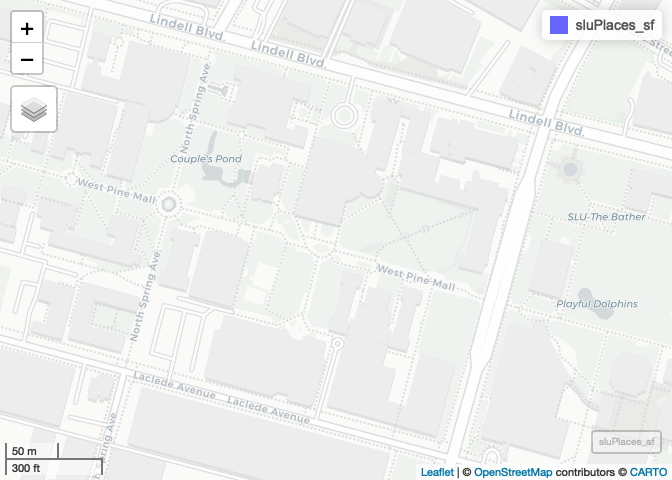
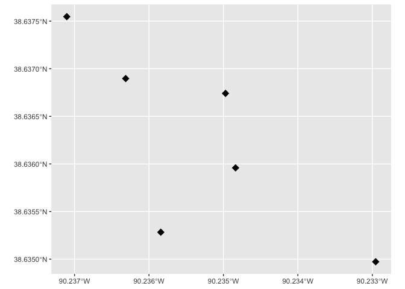
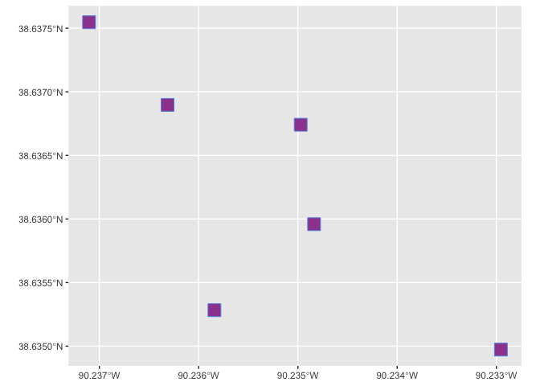

Meeting Examples, Completed
================
Christopher Prener, Ph.D.
(March 08, 2021)

## Introduction

This notebook provides examples of:

-   working with projections with `st_transform()`,
-   projecting points with `st_as_sf()`,
-   symbolizing points with `ggplot2`,
-   saving geometric data with `st_read()`,
-   calculating area with `st_area()` and the `measurements` package.

## Dependencies

This notebook requires a number of packages:

``` r
# tidyverse packages
library(dplyr)       # data cleaning
```

    ## 
    ## Attaching package: 'dplyr'

    ## The following objects are masked from 'package:stats':
    ## 
    ##     filter, lag

    ## The following objects are masked from 'package:base':
    ## 
    ##     intersect, setdiff, setequal, union

``` r
library(ggplot2)     # static mapping
library(readr)       # read/write tabular data

# spatial packages
library(mapview)     # preview spatial data
```

    ## GDAL version >= 3.1.0 | setting mapviewOptions(fgb = TRUE)

``` r
library(sf)          # spatial data tools
```

    ## Linking to GEOS 3.8.1, GDAL 3.1.4, PROJ 6.3.1

``` r
library(tigris)      # access TIGER/line data
```

    ## To enable 
    ## caching of data, set `options(tigris_use_cache = TRUE)` in your R script or .Rprofile.

``` r
# other packages
library(here)        # file path management
```

    ## here() starts at /Users/chris/GitHub/slu-soc5650/content/module-3-projections

``` r
library(measurements) # unit conversion
```

## Load Data

This notebook requires one set of data:

``` r
sluPlaces <- read_csv(here("data", "example-data", "sluPlaces.csv"))
```

    ## 
    ## ── Column specification ────────────────────────────────────────────────────────
    ## cols(
    ##   id = col_double(),
    ##   name = col_character(),
    ##   lng = col_double(),
    ##   lat = col_double()
    ## )

## Data Cleaning Notes

Make sure your `x` and `y` coordinate variables are numeric or double:

``` r
str(sluPlaces)
```

    ## spec_tbl_df [6 × 4] (S3: spec_tbl_df/tbl_df/tbl/data.frame)
    ##  $ id  : num [1:6] 1 2 3 4 5 6
    ##  $ name: chr [1:6] "Morrissey Hall" "Starbucks" "Simon Rec" "Pius Library" ...
    ##  $ lng : num [1:6] -90.2 -90.2 -90.2 -90.2 -90.2 ...
    ##  $ lat : num [1:6] 38.6 38.6 38.6 38.6 38.6 ...
    ##  - attr(*, "spec")=
    ##   .. cols(
    ##   ..   id = col_double(),
    ##   ..   name = col_character(),
    ##   ..   lng = col_double(),
    ##   ..   lat = col_double()
    ##   .. )

If they are not, use `mutate()` with `as.numeric()` to convert them.

## Identifying Coordinates

Identifying the coordinate system that `lng` and `lat` represent can be
challenging:

-   Sometimes, the “metadata” that your tabular data come with (if they
    come with any at all) will state what coordinate system was used.
    This is not typical, however.
-   Decimal degrees are one common way that we represent points. It’s
    helpful to know roughly the longitude and latitude of the area you
    are working in. For example, St. Louis is roughly located at 38
    degrees north and 90.2 degrees west. When I see `-90.2` in the
    longitude column, this immediately suggests to me that we have
    decimal degrees data here. If the data originate in the United
    States, they’re typically encoded using NAD 1983. If they are
    international data, they’ll use WGS 1984.
-   Another common way to represent data are with State Plane coordinate
    systems. There isn’t an intuitive way to identify these coordinates.
    It’s also important to know that the State Plane system ships with
    both feet and meters measurement options. Points encoded in Missouri
    State Plane East, for example, will either be encoded using feet or
    meters. Unfortunately, the `x,y` pairs for State Plane meters do not
    correspond to State Plane feet. So, we need to experiment here. Many
    local municipalities rely on State Plane for mapping out of
    tradition, and it’s therefore common to run into both the feet and
    meters versions when working with local data.
-   It’s also worth remember that some users may encode their points
    using UTM zones. This is not nearly as common as State Plane.

Once we have candidates for projecting our points, we need to identify
the CRS/EPSG values (or, alternatively, the Proj4 strings) that
correspond to our coordinate system candidate(s). For this, we’ll use
websites like [EPSG.io](https://epsg.io/) and [Spatial
Reference](https://spatialreference.org/).

## Project Data

First, we want to convert these data to from a `tibble` to an `sf`
object with `st_as_sf()`. We use the `lng` variable as our `x` variable
and `lat` as our `y` variable, and use `4269` for our `crs` argument
since these data are in decimal degrees and this corresponds to the
likely coordinate system we identified above:

``` r
sluPlaces_sf <- st_as_sf(sluPlaces, coords = c("lng", "lat"), crs = 4269)
```

Next, we want to confirm that this worked:

``` r
mapview(sluPlaces_sf)
```

<!-- -->

Excellent!

## Transform Our Projection

We’ve already used `st_transform()`, but now can do so with purpose. For
example, to convert our data to State Plane (meters). We’ll use the data
based on the 2007 update to NAD 1983:

``` r
sluPlaces_statePlane <- st_transform(sluPlaces_sf, crs = 3601)
```

If we need our data in feet, there are also options. However, these are
ESRI products that are not included in the `sf` package. How do we know?
We can use the EPSG value `102696`.

``` r
st_transform(sluPlaces_sf, crs = 102696)
```

Note that error includes this language -
`GDAL Error 1: PROJ: proj_create_from_database: crs not found`. Even so,
we can still use the coordinate system by specifying the `Proj4` string
value instead of the CRS number:

``` r
sluPlaces_statePlane_ft <- st_transform(sluPlaces_sf, crs = "+proj=tmerc +lat_0=35.83333333333334 +lon_0=-90.5 +k=0.9999333333333333 +x_0=250000 +y_0=0 +ellps=GRS80 +datum=NAD83 +to_meter=0.3048006096012192 +no_defs ")
```

This should give us correctly projected data. Using this trick with the
`Proj4` strings also works, by the way, with `st_as_sf()` as well.

## Write Data

Finally, we’ll write our data:

``` r
st_write(sluPlaces_statePlane, here("data", "example-data", "clean-data", "sluPlaces.shp"), delete_dsn = TRUE)
```

    ## Deleting source `/Users/chris/GitHub/slu-soc5650/content/module-3-projections/data/example-data/clean-data/sluPlaces.shp' using driver `ESRI Shapefile'
    ## Writing layer `sluPlaces' to data source `/Users/chris/GitHub/slu-soc5650/content/module-3-projections/data/example-data/clean-data/sluPlaces.shp' using driver `ESRI Shapefile'
    ## Writing 6 features with 2 fields and geometry type Point.

The `st_write()` function identifies the file type from what you include
at the end of the `here()` statement. If I am working solely in `R`, I
tend to use `.geojson` because:

1.  It does not impose limits on column names or data types.
2.  It is an open standard for storing data that is plain text.
3.  It can be previewed live on GitHub.com (where I share most my data).

However, if you are going to be working in the ESRI ecosystem, saving
data as shapefiles is suggested. Note that \#1 above needs to be
addressed - keep variable names short (8 characters or less) and convert
big numbers to strings or remove them completely before saving.

## Using Projections to Calculate Area

One final task we have when working with projections is to use them as
the basis for making calculations. Often, this entails calculating area
so that we can use it for normalizing our data. Sometimes our data come
with measurements, but we don’t know what those units are. Other times,
we don’t have an area measure at all. Consider these data from `tigris`:

``` r
moCounties <- counties(state = 29) %>%
  select(GEOID, NAMELSAD, ALAND, AWATER)
```

    ##   |                                                                              |                                                                      |   0%  |                                                                              |                                                                      |   1%  |                                                                              |=                                                                     |   1%  |                                                                              |=                                                                     |   2%  |                                                                              |==                                                                    |   2%  |                                                                              |==                                                                    |   3%  |                                                                              |==                                                                    |   4%  |                                                                              |===                                                                   |   4%  |                                                                              |===                                                                   |   5%  |                                                                              |====                                                                  |   5%  |                                                                              |====                                                                  |   6%  |                                                                              |=====                                                                 |   6%  |                                                                              |=====                                                                 |   7%  |                                                                              |=====                                                                 |   8%  |                                                                              |======                                                                |   8%  |                                                                              |======                                                                |   9%  |                                                                              |=======                                                               |   9%  |                                                                              |=======                                                               |  10%  |                                                                              |=======                                                               |  11%  |                                                                              |========                                                              |  11%  |                                                                              |========                                                              |  12%  |                                                                              |=========                                                             |  12%  |                                                                              |=========                                                             |  13%  |                                                                              |=========                                                             |  14%  |                                                                              |==========                                                            |  14%  |                                                                              |==========                                                            |  15%  |                                                                              |===========                                                           |  15%  |                                                                              |===========                                                           |  16%  |                                                                              |============                                                          |  16%  |                                                                              |============                                                          |  17%  |                                                                              |============                                                          |  18%  |                                                                              |=============                                                         |  18%  |                                                                              |=============                                                         |  19%  |                                                                              |==============                                                        |  19%  |                                                                              |==============                                                        |  20%  |                                                                              |==============                                                        |  21%  |                                                                              |===============                                                       |  21%  |                                                                              |===============                                                       |  22%  |                                                                              |================                                                      |  22%  |                                                                              |================                                                      |  23%  |                                                                              |================                                                      |  24%  |                                                                              |=================                                                     |  24%  |                                                                              |=================                                                     |  25%  |                                                                              |==================                                                    |  25%  |                                                                              |==================                                                    |  26%  |                                                                              |===================                                                   |  26%  |                                                                              |===================                                                   |  27%  |                                                                              |===================                                                   |  28%  |                                                                              |====================                                                  |  28%  |                                                                              |====================                                                  |  29%  |                                                                              |=====================                                                 |  29%  |                                                                              |=====================                                                 |  30%  |                                                                              |=====================                                                 |  31%  |                                                                              |======================                                                |  31%  |                                                                              |======================                                                |  32%  |                                                                              |=======================                                               |  32%  |                                                                              |=======================                                               |  33%  |                                                                              |=======================                                               |  34%  |                                                                              |========================                                              |  34%  |                                                                              |========================                                              |  35%  |                                                                              |=========================                                             |  35%  |                                                                              |=========================                                             |  36%  |                                                                              |==========================                                            |  36%  |                                                                              |==========================                                            |  37%  |                                                                              |==========================                                            |  38%  |                                                                              |===========================                                           |  38%  |                                                                              |===========================                                           |  39%  |                                                                              |============================                                          |  39%  |                                                                              |============================                                          |  40%  |                                                                              |============================                                          |  41%  |                                                                              |=============================                                         |  41%  |                                                                              |=============================                                         |  42%  |                                                                              |==============================                                        |  42%  |                                                                              |==============================                                        |  43%  |                                                                              |==============================                                        |  44%  |                                                                              |===============================                                       |  44%  |                                                                              |===============================                                       |  45%  |                                                                              |================================                                      |  45%  |                                                                              |================================                                      |  46%  |                                                                              |=================================                                     |  46%  |                                                                              |=================================                                     |  47%  |                                                                              |=================================                                     |  48%  |                                                                              |==================================                                    |  48%  |                                                                              |==================================                                    |  49%  |                                                                              |===================================                                   |  49%  |                                                                              |===================================                                   |  50%  |                                                                              |===================================                                   |  51%  |                                                                              |====================================                                  |  51%  |                                                                              |====================================                                  |  52%  |                                                                              |=====================================                                 |  52%  |                                                                              |=====================================                                 |  53%  |                                                                              |=====================================                                 |  54%  |                                                                              |======================================                                |  54%  |                                                                              |======================================                                |  55%  |                                                                              |=======================================                               |  55%  |                                                                              |=======================================                               |  56%  |                                                                              |========================================                              |  56%  |                                                                              |========================================                              |  57%  |                                                                              |========================================                              |  58%  |                                                                              |=========================================                             |  58%  |                                                                              |=========================================                             |  59%  |                                                                              |==========================================                            |  59%  |                                                                              |==========================================                            |  60%  |                                                                              |==========================================                            |  61%  |                                                                              |===========================================                           |  61%  |                                                                              |===========================================                           |  62%  |                                                                              |============================================                          |  62%  |                                                                              |============================================                          |  63%  |                                                                              |============================================                          |  64%  |                                                                              |=============================================                         |  64%  |                                                                              |=============================================                         |  65%  |                                                                              |==============================================                        |  65%  |                                                                              |==============================================                        |  66%  |                                                                              |===============================================                       |  66%  |                                                                              |===============================================                       |  67%  |                                                                              |===============================================                       |  68%  |                                                                              |================================================                      |  68%  |                                                                              |================================================                      |  69%  |                                                                              |=================================================                     |  69%  |                                                                              |=================================================                     |  70%  |                                                                              |==================================================                    |  71%  |                                                                              |==================================================                    |  72%  |                                                                              |===================================================                   |  72%  |                                                                              |===================================================                   |  73%  |                                                                              |===================================================                   |  74%  |                                                                              |====================================================                  |  74%  |                                                                              |====================================================                  |  75%  |                                                                              |=====================================================                 |  75%  |                                                                              |=====================================================                 |  76%  |                                                                              |======================================================                |  76%  |                                                                              |======================================================                |  77%  |                                                                              |======================================================                |  78%  |                                                                              |=======================================================               |  78%  |                                                                              |=======================================================               |  79%  |                                                                              |========================================================              |  79%  |                                                                              |========================================================              |  80%  |                                                                              |========================================================              |  81%  |                                                                              |=========================================================             |  81%  |                                                                              |=========================================================             |  82%  |                                                                              |==========================================================            |  82%  |                                                                              |==========================================================            |  83%  |                                                                              |==========================================================            |  84%  |                                                                              |===========================================================           |  84%  |                                                                              |===========================================================           |  85%  |                                                                              |============================================================          |  85%  |                                                                              |============================================================          |  86%  |                                                                              |=============================================================         |  86%  |                                                                              |=============================================================         |  87%  |                                                                              |=============================================================         |  88%  |                                                                              |==============================================================        |  88%  |                                                                              |==============================================================        |  89%  |                                                                              |===============================================================       |  89%  |                                                                              |===============================================================       |  90%  |                                                                              |===============================================================       |  91%  |                                                                              |================================================================      |  91%  |                                                                              |================================================================      |  92%  |                                                                              |=================================================================     |  92%  |                                                                              |=================================================================     |  93%  |                                                                              |=================================================================     |  94%  |                                                                              |==================================================================    |  94%  |                                                                              |==================================================================    |  95%  |                                                                              |===================================================================   |  95%  |                                                                              |===================================================================   |  96%  |                                                                              |====================================================================  |  96%  |                                                                              |====================================================================  |  97%  |                                                                              |====================================================================  |  98%  |                                                                              |===================================================================== |  98%  |                                                                              |===================================================================== |  99%  |                                                                              |======================================================================|  99%  |                                                                              |======================================================================| 100%

There are both `ALAND` and `AWATER` columns, but it isn’t immediately
clear what their units are (they are in meters, FYI). If we want the
total area of these units, we can combine a few functions from `sf`,
`dplyr`, and `measurements` to achieve a few different outcomes. First,
we’ll re-calculate the area based on a **projected** coordinate system.
We need to move from the current coordinate system to a projected
coordinate system. To get a sense of our starting place, we’ll use
`st_crs()`:

``` r
st_crs(moCounties)
```

    ## Coordinate Reference System:
    ##   User input: NAD83 
    ##   wkt:
    ## GEOGCRS["NAD83",
    ##     DATUM["North American Datum 1983",
    ##         ELLIPSOID["GRS 1980",6378137,298.257222101,
    ##             LENGTHUNIT["metre",1]]],
    ##     PRIMEM["Greenwich",0,
    ##         ANGLEUNIT["degree",0.0174532925199433]],
    ##     CS[ellipsoidal,2],
    ##         AXIS["latitude",north,
    ##             ORDER[1],
    ##             ANGLEUNIT["degree",0.0174532925199433]],
    ##         AXIS["longitude",east,
    ##             ORDER[2],
    ##             ANGLEUNIT["degree",0.0174532925199433]],
    ##     ID["EPSG",4269]]

This confirms that we are using a geographic coordinate system (this is
typical for TIGER/Line data). We’ll switch to Albers Equal Area Conic
for the contiguous United States:

``` r
moCounties <- st_transform(moCounties, crs = "+proj=aea +lat_1=29.5 +lat_2=45.5 +lat_0=37.5 +lon_0=-96 +x_0=0 +y_0=0 +ellps=GRS80 +datum=NAD83 +units=m +no_defs")
```

Notice how `+units=2` appears in the `Proj4` string. This means are data
are in meters. If we wanted to recalculate our area units meters, we can
use the `st_area()` function and the `geometry` column to do so:

``` r
moCounties %>%
  select(-c("ALAND", "AWATER")) %>%
  mutate(sq_m = as.numeric(st_area(geometry)), .after = NAMELSAD) %>%
  mutate(sq_km = conv_unit(sq_m, from = "m2", to = "km2"), .after = sq_m) -> moCounties
```

We can do the same thing if we want to convert to square miles:

``` r
moCounties <- mutate(moCounties, sq_mi = conv_unit(sq_m, from = "m2", to = "mi2"), .after = sq_km)
```

Writing the `sq_m` column to shapefile might be tricky, so its best to
do these conversions and then remove the source column before saving!

## Symbolizing Points

One thing I wanted to share quickly this week is how we can approach
displaying points with `ggplot2`, since we happen to have some point
data to work with. We’ll use the `shape` and `size` arguments to make
simple adjustments:

``` r
ggplot() +
  geom_sf(data = sluPlaces_sf, shape = 18, size = 4)
```

<!-- -->

Some point symbols - those with values 21 through 25 - can be customized
with fills and colors as well:

``` r
ggplot() +
  geom_sf(data = sluPlaces_sf, shape = 22, size = 6, fill = "#9d4a9d", color = "#5d92e5")
```

<!-- -->
